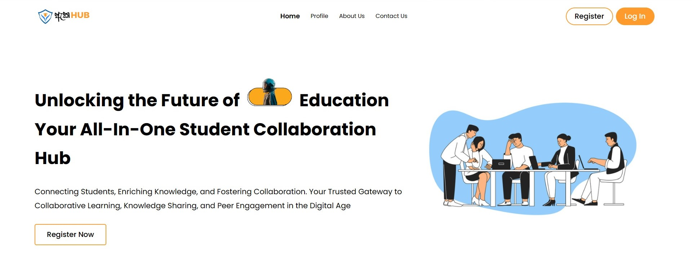

 

Student Collaboration and Connection Platform

ඇකHub is a centralized hub for sharing study materials, kuppi sessions, connecting with counselors, receiving important academic updates and announcements, hosting elections, knowledge sharing among students and sharing event details of clubs.

### Group Members 
- [Saliya Bandara](https://github.com/SaliyaBandara)
- [Kasun Udara](https://github.com/KasunUdaraWaththeHewa)
- [Samudi Perera](https://github.com/samudiperera09)
- [Virajith Dissanayaka](https://github.com/virajithdissanayaka)

### Project scope:

- Academic Material sharing hub
- Anonymous public voting system
- Academic calendar & notification system
- Private Counseling services
- Event Promotion

### Noteworthy Features

- Automated notification/email system via Cron Jobs
- Fully anonymous voting system
- Automatic parsing of timetable PDFs and calendar creation using Python
- Encrypted private chat system with counselors
- Reddit style post sharing system with threaded comments
- Easy and intuitive organization of study materials nad course content
- Simplified counselor appointment system

### Tech Stack

- PHP
- HTML | CSS | JS | jQuery
- Python
- MySQL
- Apache | Nginx

